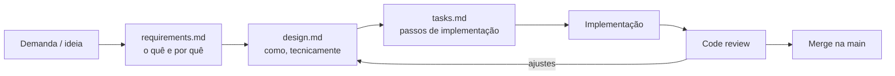

# Spec-Driven Development no FitMap

Neste projeto, toda feature nova (ou mudança relevante numa existente) começa com uma **spec**, não com código. A ideia: decidir *o quê* e *por quê* (`requirements.md`), depois *como* (`design.md`), depois quebrar em passos (`tasks.md`) — e só então implementar. Isso vale tanto para quem está codando manualmente quanto para agentes de IA (Claude Code, Cursor) trabalhando no repositório.

## Fluxo



1. **`requirements.md`** — user stories + critérios de aceite (formato Given/When/Then). Sem termos técnicos de implementação.
2. **`design.md`** — decisão técnica: quais camadas/módulos são afetados, contratos de dados, diagrama quando ajudar, alternativas consideradas e riscos.
3. **`tasks.md`** — checklist de implementação, rastreável de volta aos requisitos.
4. Implementação segue o `tasks.md`; o code review confere se o resultado bate com o `requirements.md`.

Todas as specs devem respeitar as regras do projeto em [`constitution.md`](constitution.md).

## Como criar uma spec nova

```sh
cp -r specs/_template specs/<nome-da-feature>
```

Use `<nome-da-feature>` em kebab-case, prefixado pelo módulo quando fizer sentido (ex.: `auth-signin`, `auth-recover-password`, `map-discovery`). Preencha os três arquivos nessa ordem, um de cada vez — não pule para `tasks.md` sem fechar `design.md`.

## Specs existentes

| Spec | Módulo | Status |
|---|---|---|
| [`auth-signin`](auth-signin) | auth | ✅ exemplo de referência (completo) |
| [`shared-http-client`](shared-http-client) | shared | ✅ completo |

## Backlog (a especificar)

Features já conhecidas que ainda não têm spec — criar a partir do template quando o trabalho começar:

| Feature sugerida | Módulo |
|---|---|
| `auth-recover-password` | auth |
| `students-*` (perfil, jornada do aluno) | students |
| `personals-*` (perfil, agenda do personal) | personals |
| `map-discovery` (encontrar personal/aluno no mapa) | map |
