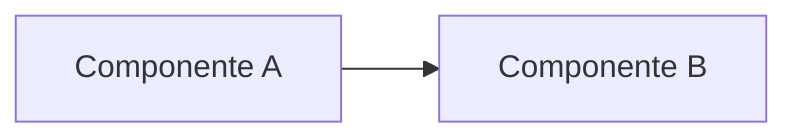

# Design — `nome-da-feature`

> Preencha depois de `requirements.md` estar alinhado. Aqui entra o *como*, técnico. Antes de escrever, releia [specs/constitution.md](../constitution.md) e as regras de fronteira do [README.md](../../README.md#arquitetura).

## Visão geral técnica

<!-- 2-3 frases: abordagem escolhida em alto nível. -->

## Módulos e camadas afetados

<!-- Ex.: src/modules/auth/{presentation/views,presentation/view-model,data/infra/repositories}, src/shared/data/http -->

-

## Diagrama (se ajudar a explicar fluxo/dependências)



## Contratos de dados / API

<!-- Formato de request/response, ou a interface do repositório (TypeScript). -->

```ts
// exemplo
interface ExampleRepository {
  doSomething(input: Input): Promise<Output>;
}
```

## Estados de UI a cobrir

<!-- loading, sucesso, erro, vazio, offline — o que se aplicar. -->

- [ ] Loading
- [ ] Sucesso
- [ ] Erro
- [ ] Vazio

## Alternativas consideradas

<!-- O que mais foi cogitado e por que foi descartado. Pode ser "N/A" se a solução é óbvia. -->

## Riscos e trade-offs

<!-- Inclua aqui qualquer ponto que tensiona com specs/constitution.md, e como foi resolvido/aprovado. -->
