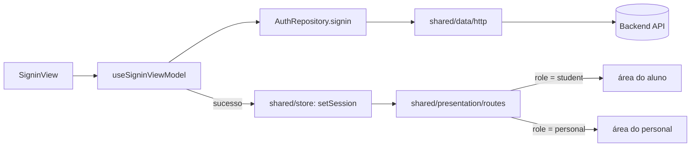

# Design — auth-signin

## Visão geral técnica

Tela de login clássica (e-mail/senha) no módulo `auth`, seguindo o padrão view → view-model → repository → http. A decisão de para onde navegar após o login (área do aluno ou do personal) não é responsabilidade do módulo `auth` — ele apenas grava a sessão em `shared/store`; quem decide a stack de navegação é `shared/presentation/routes`, que observa a sessão. Isso evita que `auth` precise conhecer os módulos `students`/`personals` (regra de fronteira do projeto).

## Módulos e camadas afetados

- `src/modules/auth/presentation/views` — `SigninView` (campos, botão, link de recuperação de senha).
- `src/modules/auth/presentation/view-model` — `useSigninViewModel` (estado idle/loading/error/success, validação de e-mail, chamada ao repositório).
- `src/modules/auth/data/infra/repositories` — `AuthRepository.signin`.
- `src/shared/data/http` — cliente HTTP existente, reaproveitado (nenhuma mudança esperada).
- `src/shared/store` — slice de sessão (`session`: usuário autenticado + token; ações `setSession`/`clearSession`), consumido por qualquer módulo que precise saber "quem está logado".
- `src/shared/presentation/routes` — lê `session.user.role` e decide entre stack `student` e stack `personal`.
- `src/shared/@types` — tipos `UserRole`, `AuthenticatedUser`, `AuthSession` (compartilhados; não pertencem só a `auth`, pois `shared/store` e `shared/presentation/routes` também os usam).

## Diagrama



## Contratos de dados / API

```ts
// src/shared/@types
type UserRole = 'student' | 'personal';

interface AuthenticatedUser {
  id: string;
  name: string;
  email: string;
  role: UserRole;
}

interface AuthSession {
  user: AuthenticatedUser;
  token: string;
}

// src/modules/auth/data/infra/repositories
interface SigninCredentials {
  email: string;
  password: string;
}

interface AuthRepository {
  signin(credentials: SigninCredentials): Promise<AuthSession>;
}
```

Erros de API (401 credenciais inválidas, erro de rede) são mapeados no repositório para um tipo de erro do domínio (`AuthError`, com `kind: 'invalid-credentials' | 'network' | 'unknown'`), para a view-model não precisar conhecer status HTTP.

## Estados de UI a cobrir

- [ ] Idle (formulário vazio, botão habilitado só com e-mail+senha preenchidos)
- [ ] Loading (spinner, botão desabilitado)
- [ ] Erro de validação de e-mail (inline, sem chamar API)
- [ ] Erro de credenciais inválidas (mensagem genérica acima do formulário)
- [ ] Erro de rede (mensagem distinta, com opção de tentar novamente)
- [ ] Sucesso (navegação automática, sem tela de transição própria)

## Alternativas consideradas

- **Guardar token em `AsyncStorage` puro**: descartado — não é armazenamento seguro; token vai em Keychain/Keystore (ver Riscos).
- **`auth` decidir a navegação pós-login diretamente**: descartado — exigiria `auth` importar `students`/`personals` ou suas rotas, violando a regra de fronteira do projeto. `shared/presentation/routes` decide, observando a sessão em `shared/store`.

## Riscos e trade-offs

- Nenhuma lib de armazenamento seguro está instalada em `package.json` hoje. Antes de implementar o requisito 7 (persistência segura da sessão), é preciso avaliar e adicionar uma (ex. `react-native-keychain`), o que mexe em `ios/`/`android/` — validar com o time antes de adicionar essa dependência nativa.
- Mensagens de erro genéricas (requisito 3) dependem do backend também não vazar essa informação (ex. retornar 401 igual tanto para "e-mail não existe" quanto para "senha errada"); se o backend hoje distingue os dois casos, isso precisa ser alinhado com o time de backend, não só resolvido no app.
