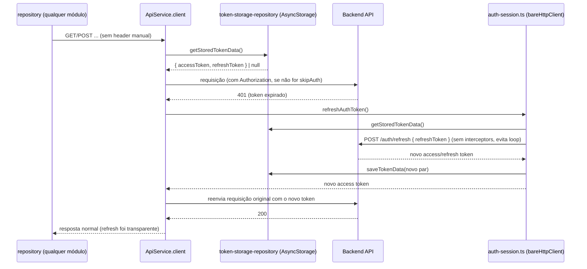

# Design — shared-http-client

## Visão geral técnica

Um `ApiService` — classe singleton em `src/shared/data/http/axios-interceptors.ts` — concentra o cliente HTTP do projeto: `client` (axios com interceptors), interceptor de request (injeta `Authorization` por padrão) e de response (normaliza erro por status e, em 401, tenta renovar o token uma vez antes de desistir, delegando pra `auth-session.ts`). Não há cache em memória dos tokens: cada leitura vai direto no `AsyncStorage` (via `token-storage-repository.ts`), então persistir sessão entre reinícios do app já vem de graça, sem passo de "reidratação" no boot.

Essa estrutura (classe única pros interceptors, sem módulo de estado em memória separado) foi um pedido explícito de quem pediu a feature — uma versão anterior desta spec usava módulos funcionais decompostos (`auth-token-store.ts`, `refresh-session.ts`) com um cache em memória e um pub/sub de sincronização com o disco; foi trocada por isto nesta conversa.

## Módulos e camadas afetados

- `src/shared/config/env.ts` — `API_BASE_URL`, `HTTP_TIMEOUT_MS`.
- `src/shared/@types/axios.d.ts` — module augmentation de `AxiosRequestConfig` (`skipAuth`, `_retry`); tipos TS globais ficam em `shared/@types` por convenção do projeto, em vez de dentro do arquivo que usa o axios.
- `src/shared/data/http/auth-session.ts` — `refreshAuthToken()` (renovação com lock single-flight, via uma instância axios própria — `bareHttpClient` — sem os interceptors do cliente principal) e `setAuthTokens()` (persiste o par de tokens). Extraído de dentro da classe `ApiService` pra arquivo próprio, a pedido de quem pediu a feature.
- `src/shared/data/http/axios-interceptors.ts` — classe `ApiService` (singleton, `ApiService.getInstance()`): `client` (axios), `setupInterceptors()` (importa `refreshAuthToken`/`setAuthTokens` de `auth-session.ts`), `clearAuthTokens`, `setUnauthorizedHandler`, `normalizeError`.
- `src/shared/data/http/http-error.ts` — classe `HttpError` (estende `Error`) + `HttpErrorCode` + normalização por status.
- `src/shared/data/infra/repositories/token-storage-repository.ts` — acesso cru ao `AsyncStorage` para o par de tokens (get/save/clear); é a única coisa que `auth-session.ts`/`ApiService` conhecem de storage.
- `jest.config.js` / `jest.setup.js` — mock oficial do `@react-native-async-storage/async-storage` nos testes, e `transformIgnorePatterns` ampliado (o build ESM da lib precisa passar pelo babel-jest).
- `package.json` — adiciona `axios` e `@react-native-async-storage/async-storage` como dependências.

Sem barrel (`index.ts`) em nenhuma pasta — decisão explícita de quem pediu a feature: cada arquivo é importado pelo caminho direto (ex.: `from '.../token-storage-repository'`), nunca por um `index.ts` que reexporta tudo.

Nenhum módulo em `src/modules` é alterado nesta spec — eles passam a poder consumir `ApiService.getInstance().client` no futuro (ex.: `AuthRepository` da spec `auth-signin`, que chamaria `ApiService.getInstance().setAuthTokens(...)` após um login bem-sucedido).

## Diagrama



## Contratos de dados / API

```ts
// src/shared/data/http/http-error.ts
type HttpErrorCode =
  | 'bad-request' | 'unauthorized' | 'forbidden' | 'not-found'
  | 'validation' | 'rate-limited' | 'server' | 'network' | 'unknown';

class HttpError extends Error {
  code: HttpErrorCode;
  status: number | null;
  fields?: Record<string, string[]>;
  retryAfter?: number;
  cause: unknown;
}

// src/shared/data/infra/repositories/token-storage-repository.ts
interface StoredTokenData {
  accessToken: string;
  refreshToken: string;
}
function getStoredTokenData(): Promise<StoredTokenData | null>;
function saveTokenData(tokenData: StoredTokenData): Promise<void>;
function clearStoredTokenData(): Promise<void>;

// src/shared/data/http/auth-session.ts
function refreshAuthToken(): Promise<string | null>; // single-flight
function setAuthTokens(accessToken: string, refreshToken?: string): Promise<void>;

// src/shared/data/http/axios-interceptors.ts
class ApiService {
  static getInstance(): ApiService;
  readonly client: AxiosInstance; // usado pelos repositories de todo módulo
  setUnauthorizedHandler(cb: () => void): void;
  setAuthTokens(accessToken: string, refreshToken?: string): Promise<void>; // delega pra auth-session.ts
  clearAuthTokens(): Promise<void>;
  normalizeError(error: unknown): HttpError; // pra usar fora dos interceptors também (ex. catch manual)
}
```

`AxiosRequestConfig` ganha `skipAuth?: boolean` via module augmentation (não injeta `Authorization` — rotas públicas: signin, refresh) e `_retry?: boolean` (uso interno, evita re-tentar refresh duas vezes na mesma requisição).

Contrato assumido do endpoint de refresh (backend real ainda não existe — ver Riscos):

```
POST /auth/refresh
body: { refreshToken: string }
200: { accessToken: string; refreshToken?: string }
```

## Estados de UI a cobrir

N/A — esta spec é infraestrutura pura (`shared/data/http`), sem UI própria. Loading/erro continuam responsabilidade da `view-model` de cada módulo consumidor, que recebe um `HttpError` já normalizado (via interceptor, ou chamando `ApiService.getInstance().normalizeError(error)` manualmente num `catch`).

## Alternativas consideradas

- **Cache de token em memória + pub/sub de sincronização com `AsyncStorage`** (versão anterior desta spec): descartado a pedido de quem implementa — adicionava um módulo extra (`auth-token-store.ts`) e um passo de "reidratação" obrigatório no boot do app (`restoreAuthTokens()`) fácil de esquecer de chamar. A troca (ler `AsyncStorage` a cada requisição) é mais simples e elimina esse passo, ao custo de um I/O de disco por requisição — aceito explicitamente.
- **Rota pública detectada por URL** (`isAuthRoute`, ex. `url.includes('/auth/signin')`, como na referência que inspirou este desenho): descartado — faria `data/http` "conhecer" rotas específicas do módulo `auth`, e quebra se o path mudar. `{ skipAuth: true }` por requisição deixa a decisão explícita em quem chama.
- **Um `AppError` novo para os erros normalizados**: descartado — `HttpError` já cobre os 7 status pedidos (400/401/403/404/422/429/500) com `fields` (422) e `retryAfter` (429); criar uma segunda classe ao lado duplicaria isso.
- **Fazer o refresh usando o próprio `client` (com os mesmos interceptors)**: descartado — geraria loop (a própria chamada de refresh disparando o interceptor de 401). Por isso `auth-session.ts` cria sua própria instância axios (`bareHttpClient`), isolada.
- **`refreshAuthToken`/`setAuthTokens` como métodos privados/públicos de `ApiService`** (versão anterior desta sessão): descartado a pedido de quem implementa — extraídos pra `auth-session.ts`, importados por `axios-interceptors.ts`. `ApiService.setAuthTokens` continua existindo como um método fino que só delega, pra não quebrar quem já chama `ApiService.getInstance().setAuthTokens(...)`.
- **Retry automático também para 429/5xx**: descartado por ora (fora de escopo) — política de retry/backoff genérica é um problema separado do pedido nesta tarefa.

## Riscos e trade-offs

- **Contrato do endpoint de refresh é uma suposição** (`POST /auth/refresh` com `{ refreshToken }` → `{ accessToken, refreshToken? }`) — não há backend real ainda. Fica isolado em `refreshTokensAsync()` (dentro de `ApiService`) para o ajuste ser barato quando a API existir.
- **Formato do erro 422 é uma suposição** (`response.data.errors: Record<string, string[]>`, estilo comum tipo Laravel/JSON:API). Se o backend real usar outro formato, só `http-error.ts` precisa mudar.
- **`src/shared/config/env.ts` usa `process.env` como placeholder**, mas o projeto não tem uma solução de env vars para RN configurada (nenhuma lib tipo `react-native-config`/`react-native-dotenv` no `package.json`). Isso não quebra nenhuma regra da constituição (nenhum segredo fica hardcoded), mas a solução definitiva de configuração por ambiente fica pendente de decisão do time.
- **Decisão consciente: token persistido em `AsyncStorage` puro, não em storage seguro (Keychain/Keystore).** A spec `auth-signin` (requisito não-funcional de segurança) pede storage seguro para o token de sessão — `AsyncStorage` não criptografa o conteúdo em repouso. Optamos por isso agora, deliberadamente, para destravar login persistente sem depender de escolher/instalar uma lib nativa de storage seguro. **Decisão confirmada com quem pediu a feature nesta conversa** (trade-off aceito, não é uma pendência silenciosa). Mitigação: a troca para `react-native-keychain` (ou equivalente) fica isolada em `token-storage-repository.ts` — nenhum outro arquivo muda quando isso acontecer. Tratar como item de hardening obrigatório antes de produção.
- **Um `AsyncStorage.getMany` por requisição** (para ler o token) — aceito explicitamente a pedido de quem implementa, em troca de eliminar o módulo de cache em memória e o passo de reidratação no boot. Se isso pesar em performance real, o próximo passo é reintroduzir um cache em memória invalidado pelos próprios métodos `setAuthTokens`/`clearAuthTokens` da classe (mantendo a mesma API pública).
- **`data/http` (`ApiService`) chama `data/infra/repositories/token-storage-repository.ts` diretamente** — inverte o sentido "repository depende de http" do diagrama de camadas do README para este caso específico de gestão de token. Aceito deliberadamente aqui (mesmo padrão da referência que motivou este desenho); não é uma regra de fronteira do `specs/constitution.md` (que trata de módulo↔módulo, não de sub-camadas dentro de `shared`), então não é uma violação — é uma escolha de wiring interno.
- **`setUnauthorizedHandler` aceita um único callback** (chamar de novo substitui o anterior, não empilha) — suficiente para o caso de uso atual (um único lugar decide o que fazer quando a sessão expira, tipicamente `shared/presentation/routes`). Se mais de um consumidor precisar reagir, isso vira um pub/sub (múltiplos listeners) sem mudar a assinatura pública de fora.
- **Pegadinha de TypeScript em `shared/@types/axios.d.ts`, documentada pra não se repetir**: um arquivo `.d.ts` que só tem `declare module 'axios' { ... }` e nenhum `import`/`export` próprio é tratado pelo TypeScript como *script* global, não como módulo — nesse caso o `declare module` deixa de **aumentar** os tipos reais do axios e passa a **substituí-los por completo** (todo `AxiosError`/`AxiosHeaders`/`AxiosInstance`/etc. some, e `axios.create`/`axios.isAxiosError` desaparecem). O arquivo precisa de um `export {};` no topo pra ser reconhecido como módulo e só então aumentar (mergear) a interface `AxiosRequestConfig` de verdade. Isso não é specífico deste projeto — é assim que o TypeScript trata qualquer arquivo de augmentation de um módulo de terceiros.
