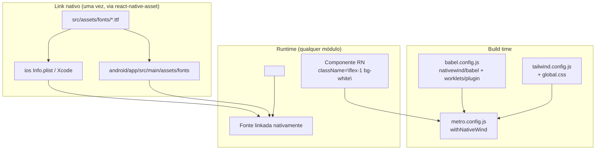

# Design — shared-styling-setup

## Visão geral técnica

Duas peças de infra, ambas em `shared`/raiz do projeto (nenhum módulo de negócio é tocado):

1. **Fontes**: os `.ttf` estáticos (um arquivo por peso, nome de arquivo = `fontFamily` já usado em `theme.ts`) entram em `src/assets/fonts/` — pasta já prevista no README (`assets/ # imagens, ícones, fontes`) —, linkados nativamente via `react-native.config.js` (`assets: ['./src/assets/fonts']`) + `react-native-asset` (ferramenta de linha de comando que copia pro Android e atualiza `Info.plist`/Xcode do iOS). `src/shared/common/fonts/index.ts` (o único ponto com `@expo-google-fonts/*`) é removido — sem substituto, porque bare RN não precisa de um módulo JS pra "carregar" fonte em runtime (isso é coisa do `expo-font`); uma vez linkada nativamente, a fonte só existe como string em `fontFamily`, e `theme.ts` já é essa fonte única de verdade.
2. **NativeWind**: `nativewind` (styling) + `tailwindcss` v3 (compilador — NativeWind v4 só suporta Tailwind v3, ver Riscos) + `react-native-reanimated`/`react-native-worklets` (usados pelas features de animação/transição do NativeWind), configurados via `babel.config.js`, `metro.config.js`, `tailwind.config.js` e um `global.css` importado uma vez em `App.tsx`.

## Módulos e camadas afetados

- `src/shared/common/fonts/` — **removido** (só continha o import de `@expo-google-fonts/*`; nada mais em `shared` ou em qualquer módulo importava esse arquivo).
- `src/assets/fonts/` — **novo**: 16 arquivos `.ttf` (Montserrat 100/400/500/600/700, NunitoSans 400/600/700, OpenSans 300/400/500/600/700, Roboto 400/500/700) + `OFL.txt` (licença consolidada das 4 famílias, todas SIL OFL 1.1).
- `react-native.config.js` — **novo**, raiz do projeto: `assets: ['./src/assets/fonts']`, consumido pelo `react-native-asset` (devDependency) pra linkar Android/iOS.
- `android/app/src/main/assets/fonts/` e `ios/*.xcodeproj` / `Info.plist` — atualizados pelo `react-native-asset` (não escritos à mão).
- `babel.config.js` — presets ganham `nativewind/babel`; `plugins` ganha `react-native-worklets/plugin` (tem que ser o último plugin — exigência do Reanimated).
- `metro.config.js` — `withNativeWind(config, { input: './src/shared/styles/global.css' })`.
- `tailwind.config.js` — **novo**, raiz do projeto: `content` cobrindo `src/**/*.{js,jsx,ts,tsx}` + `App.tsx`, `presets: [require('nativewind/preset')]`, `theme.extend.fontFamily` com as 16 fontes.
- `src/shared/styles/global.css` — **novo**: as 3 diretivas do Tailwind.
- `nativewind-env.d.ts` — **novo**, raiz do projeto: referência de tipos pro `className` aparecer tipado em qualquer componente RN.
- `App.tsx` — importa `./src/shared/styles/global.css` no topo do arquivo (é o *app shell*, fora de `src/modules`, então pode importar de `shared` livremente).
- `package.json` — novas dependencies (`nativewind`, `react-native-reanimated`, `react-native-worklets`) e devDependencies (`tailwindcss`, `react-native-asset`).
- `jest.config.js` / `jest/css-mock.js` — **novo**: `moduleNameMapper` pra `.css` (o `global.css` importado em `App.tsx` não existe pro Jest, que não processa CSS — só o Metro faz isso no build real) e `transformIgnorePatterns` ampliado pra incluir `react-native-css-interop` (dependência do NativeWind que expõe um arquivo com JSX não-compilado em `node_modules`, precisa passar pelo babel-jest como as outras exceções já listadas ali).
- `ios/` (Pods) — `bundle exec pod install --project-directory=ios` depois do `npm install` (dependência nativa nova: Reanimated/Worklets), seguindo a convenção já documentada no `CLAUDE.md`.

Nenhum módulo em `src/modules` é alterado — eles passam a *poder* usar `className` e as fontes, mas nenhuma view existente é migrada (fora de escopo, ver `requirements.md`).

## Diagrama



## Contratos de dados / API

```js
// react-native.config.js
module.exports = {
  assets: ['./src/assets/fonts'],
};

// tailwind.config.js
module.exports = {
  content: ['./App.tsx', './src/**/*.{js,jsx,ts,tsx}'],
  presets: [require('nativewind/preset')],
  theme: {
    extend: {
      fontFamily: {
        // mantém o mesmo nome de string já usado em theme.ts (shared/styles/theme/theme.ts → fonts)
        'montserrat-thin': ['Montserrat_100Thin'],
        'montserrat-regular': ['Montserrat_400Regular'],
        // ... demais pesos, 1:1 com theme.ts
      },
    },
  },
  plugins: [],
};
```

```css
/* src/shared/styles/global.css */
@tailwind base;
@tailwind components;
@tailwind utilities;
```

```ts
// nativewind-env.d.ts (raiz)
/// <reference types="nativewind/types" />
```

## Estados de UI a cobrir

N/A — spec de infraestrutura pura (config + assets), sem tela própria.

## Alternativas consideradas

- **Fontes variáveis** (1 arquivo por família, ex. `Montserrat[wght].ttf`, usando `fontWeight` em vez de um `fontFamily` por peso): descartado nesta conversa — exigiria reescrever a API de `theme.ts` (`fonts`) e qualquer código que vier a consumi-la; o `google/fonts` (repositório oficial no GitHub) também não publica mais `.ttf` estático pra essas famílias, só variável. Optamos por manter a convenção de nome que já existe em `theme.ts` (compatível com a que o `@expo-google-fonts` usava).
- **Baixar os `.ttf` estáticos direto do `google/fonts`**: não é mais possível pra estas 4 famílias — o repositório oficial migrou pra fonte variável (`ofl/montserrat`, `ofl/opensans`, etc. só têm `[wght].ttf`, sem pasta `static/`). Os `.ttf` estáticos usados aqui vieram de dentro dos pacotes `@expo-google-fonts/*` (que os empacotam prontos, com o nome de arquivo/família exatamente igual ao que `theme.ts` já esperava) — usados só como fonte de arquivo binário nesta sessão, não como dependência do projeto (nenhum pacote `@expo-google-fonts/*` entra no `package.json`).
- **Não incluir `react-native-reanimated`/`react-native-worklets` agora** (só o NativeWind essencial, sem animação/transição): considerado e descartado nesta conversa — confirmado explicitamente que o setup deve vir completo, incluindo o que o guia oficial do NativeWind recomenda pra RN CLI.
- **`prettier-plugin-tailwindcss`** (ordena classes automaticamente no `prettier`): descartado — a versão atual exige `prettier@^3`, e o projeto está fixo em `prettier@2.8.8` (`.prettierrc.js`); trocar a versão do Prettier reformataria o projeto inteiro, fora do escopo desta tarefa. Fica registrado como possível follow-up se/quando o time decidir subir o Prettier.
- **NativeWind v5 (preview)**, que já suporta Tailwind v4: descartado — ainda é `preview` (não `latest`), e o próprio código do NativeWind v4 lança erro explícito (`"NativeWind only supports Tailwind CSS v3"`) se detectar Tailwind v4. Ficamos em v4 estável + Tailwind v3.4.x.

## Riscos e trade-offs

- **NativeWind v4 trava em Tailwind v3** (`peerDependencies: { tailwindcss: ">3.3.0" }`, mas o próprio compilador interno do pacote rejeita v4 em runtime). Fixamos `tailwindcss` em `^3.4.19` deliberadamente — **não** atualizar para Tailwind v4 enquanto o projeto usa NativeWind v4.
- **`react-native-reanimated` v4 exige New Architecture** — já ativa por padrão no projeto (`android/gradle.properties: newArchEnabled=true`; RN 0.87 usa New Architecture por padrão no iOS via `use_react_native!` do Podfile, sem flag explícita desativando). Se algum dia a New Architecture for desativada, o Reanimated precisa ser revisto junto.
- **`react-native-worklets/plugin` precisa ser o último item de `plugins` no `babel.config.js`** (exigência documentada do próprio Reanimated/Worklets) — qualquer plugin de babel adicionado depois disso no futuro tem que vir antes dele na lista, não depois.
- **`bundle exec pod install --project-directory=ios` foi rodado nesta sessão** — Reanimated, Worklets, AsyncStorage e safe-area-context autolinkados sem erro (90 dependências, 89 pods instalados). O build completo (Xcode/simulador) em si não foi validado nesta sessão — só a instalação dos pods.
- **Fontes redistribuídas no repositório**: as 4 famílias são SIL OFL 1.1 (permite embutir/redistribuir com software), texto da licença incluído em `src/assets/fonts/OFL.txt`. Se uma fonte paga/proprietária for adicionada no futuro, a licença dela precisa ser conferida antes — OFL não é a licença padrão de toda fonte.
- **`npm audit` aponta 1 vulnerabilidade moderada** (`uuid` < 11.1.1, sem correção disponível) puxada por `react-native-asset` → `xcode` → `uuid`. `react-native-asset` é devDependency, usada só localmente pra rodar o link de assets (não entra no bundle do app) — risco aceito, sem ação necessária além de acompanhar se uma versão corrigida do `xcode`/`react-native-asset` sair. As demais vulnerabilidades reportadas (`metro`/`@react-native/*`) já existiam antes desta spec, no toolchain do próprio React Native 0.87.1 — não são introduzidas por esta mudança.
- **`tailwind.config.js` não importa os tokens de `theme.ts`** (cores, espaçamento) — ver `requirements.md` → Fora de escopo. Isso é uma decisão consciente pra não acoplar um arquivo `.js` (carregado em Node puro pelo Tailwind/Metro) a um arquivo `.ts` do projeto (exigiria `ts-node`/transpilação extra só pra isso); o `fontFamily` é duplicado manualmente entre os dois arquivos (só strings curtas, baixo risco de dessincronizar) — comentário cruzado nos dois arquivos aponta um pro outro.
