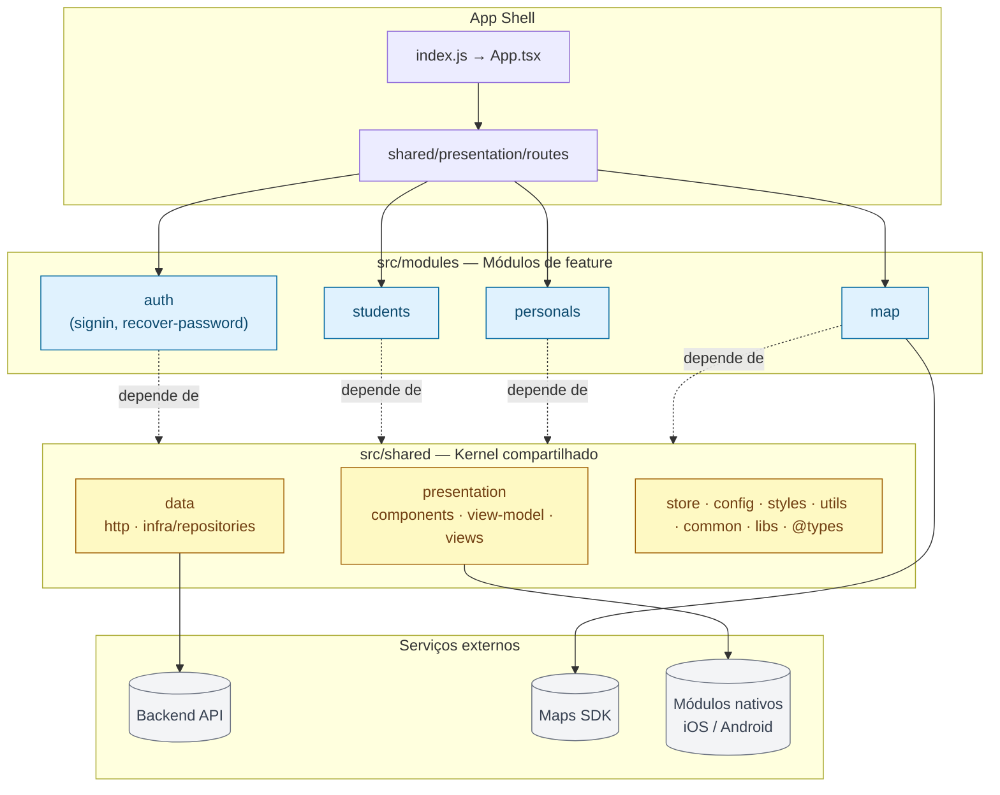
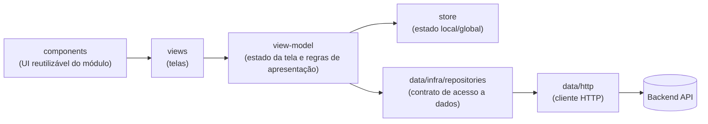
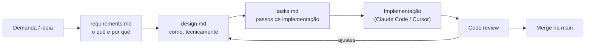

# FitMap

Aplicativo mobile (React Native) que conecta **personal trainers** e **alunos**, com descoberta geográfica via mapa.

- 🏋️ **personals** — perfil, agenda e área de trabalho do personal trainer
- 🙋 **students** — perfil e jornada do aluno
- 🔐 **auth** — `signin` e `recover-password`
- 🗺️ **map** — descoberta geográfica (encontrar personal/aluno por localização)

> Módulos em itálico acima ainda não têm código — este documento descreve a arquitetura combinada para guiar a implementação.

## Sumário

- [Stack](#stack)
- [Arquitetura](#arquitetura)
- [Como rodar o projeto](#como-rodar-o-projeto)
- [Scripts disponíveis](#scripts-disponíveis)
- [Fluxo de desenvolvimento (Spec-Driven Development)](#fluxo-de-desenvolvimento-spec-driven-development)
- [Assistentes de IA (Claude Code & Cursor)](#assistentes-de-ia-claude-code--cursor)
- [Roadmap](#roadmap)

## Stack

| Camada | Tecnologia |
|---|---|
| App | React Native 0.87, React 19 |
| Linguagem | TypeScript |
| Testes | Jest + react-test-renderer |
| Lint/Format | ESLint (`@react-native/eslint-config`) + Prettier |
| iOS | CocoaPods, Xcode workspace em `ios/` |
| Android | Gradle em `android/` |
| Node | `>= 22.11.0` (ver `engines` em `package.json`) |

## Arquitetura

O FitMap segue uma **arquitetura modular em camadas**: cada capacidade de negócio (auth, students, personals, map) é um **módulo de feature** autocontido, e tudo que é reaproveitável entre módulos vive em um **kernel compartilhado** (`src/shared`).

### Visão geral



### Regra de dependência

> **Módulo → Shared: permitido. Módulo → Módulo: proibido.**

- Um módulo pode importar de `src/shared`, nunca de outro módulo em `src/modules`.
- Se `personals` precisa exibir dados de `students` (ex.: no mapa), a composição acontece em **shared/store** (estado global), em **shared/presentation/routes** (navegação com parâmetros) ou em um contrato explícito — nunca com um `import` direto de um módulo para dentro do outro.
- Isso é o que torna os módulos substituíveis/removíveis sem efeito cascata.

### Camadas dentro de um módulo

Cada módulo (e o próprio `shared`) segue o mesmo padrão interno — MVVM + repositório, inspirado em Clean Architecture:



- **views**: apenas UI declarativa; não fala com rede nem contém regra de negócio.
- **view-model**: ponte entre a view e os dados; concentra estado e regra de apresentação; é a camada testável sem precisar renderizar UI.
- **infra/repositories**: implementa o acesso a dados por trás de um contrato — troca de fonte de dados (API real ↔ mock) não deveria exigir mudar a view-model.
- **http**: cliente HTTP único e configurado (headers, base URL, interceptors), reaproveitado por todos os repositórios.

### Vantagens

1. **Escalabilidade por domínio** — `auth`, `students`, `personals` e `map` evoluem em paralelo, com menos conflito de merge entre pessoas/times.
2. **Localização previsível de código** — qualquer coisa de "aluno" está inteira em `src/modules/students`; reduz tempo de busca e onboarding.
3. **Baixo acoplamento por construção** — proibir `módulo → módulo` força reuso via `shared/`, evitando o "espaguete" comum em apps RN que crescem rápido.
4. **Testabilidade** — `view-model` isolado de UI e de rede (via contrato de repositório) é fácil de testar e de mockar.
5. **Pronto para crescer** — cada módulo já nasce isolado o bastante para, no futuro, virar um pacote de monorepo ou ter rotas carregadas sob demanda.

### Desvantagens

1. **Overhead inicial** — para uma tela simples como `recover-password`, criar `view + view-model + repository` pode parecer burocracia para um MVP.
2. **Exige disciplina** — nada impede, hoje, que alguém importe direto de outro módulo "pra economizar tempo"; a regra só se sustenta com revisão de código atenta (ou, futuramente, uma regra de lint de fronteiras, ex. `eslint-plugin-boundaries`).
3. **Mais indireção** — entender "de onde vem esse dado" exige percorrer `view → view-model → repository → http`, mais saltos do que um `fetch` direto na tela.
4. **Risco de duplicação** — sem revisar o `shared/` antes de implementar, é fácil recriar a mesma lógica (ex.: formatação de data) em `students` e em `personals`.
5. **Comunicação entre módulos exige desenho** — cenários como "personal vê alunos no mapa" precisam de um canal combinado (store global, navegação, eventos), o que dá mais trabalho de design do que simplesmente importar o outro módulo.

**Quando essa arquitetura vale a pena:** quando o app tem múltiplos domínios de negócio que crescem de forma relativamente independente (nosso caso: aluno, personal, autenticação, mapa) e mais de uma pessoa mexe no código ao mesmo tempo. Para um protótipo descartável de tela única, é overhead desnecessário.

### Estrutura de pastas

```
src/
├── assets/                      # imagens, ícones, fontes
├── modules/                     # módulos de feature (domínio de negócio)
│   ├── auth/
│   │   ├── signin/
│   │   ├── recover-password/
│   │   ├── data/
│   │   ├── presentation/
│   │   │   ├── components/
│   │   │   ├── view-model/
│   │   │   └── views/
│   │   └── store/
│   ├── students/
│   ├── personals/
│   └── map/
└── shared/                      # kernel compartilhado entre módulos
    ├── @types/                  # tipos TS globais
    ├── common/                  # constantes/helpers de domínio compartilhados
    ├── config/                  # env, tema, configuração de navegação
    ├── data/
    │   ├── http/                 # cliente HTTP (axios/fetch wrapper)
    │   └── infra/repositories/   # implementações de repositórios
    ├── libs/                    # wrappers de bibliotecas de terceiros
    ├── presentation/
    │   ├── components/           # design system / UI genérica
    │   ├── routes/                # configuração de navegação
    │   ├── view-model/            # view-model base
    │   └── views/                 # telas genéricas (erro, loading, etc.)
    ├── store/                   # estado global
    ├── styles/                  # design tokens / tema
    └── utils/                   # funções utilitárias puras
```

> Cada módulo em `src/modules/*` segue internamente o mesmo padrão de `data/` + `presentation/{components,view-model,views}` + `store/` já usado em `src/shared`.

## Como rodar o projeto

Pré-requisitos: siga o guia [Set Up Your Environment](https://reactnative.dev/docs/set-up-your-environment) do React Native e use Node `>= 22.11.0`.

```sh
npm install
```

### 1. Subir o Metro

```sh
npm start
```

### 2. Rodar o app

Em outro terminal, com o Metro rodando:

```sh
# Android
npm run android

# iOS (primeira vez ou após atualizar deps nativas)
bundle install
bundle exec pod install --project-directory=ios
npm run ios
```

Para recarregar manualmente: **Android** — tecle <kbd>R</kbd> duas vezes ou abra o Dev Menu (<kbd>Ctrl</kbd>/<kbd>Cmd</kbd> + <kbd>M</kbd>); **iOS** — tecle <kbd>R</kbd> no simulador.

Problemas na configuração? Veja o [guia de Troubleshooting](https://reactnative.dev/docs/troubleshooting) do React Native.

## Scripts disponíveis

| Script | Descrição |
|---|---|
| `npm start` | Sobe o Metro bundler |
| `npm run android` | Builda e roda no Android |
| `npm run ios` | Builda e roda no iOS |
| `npm run lint` | ESLint em todo o projeto |
| `npm test` | Testes com Jest |

## Fluxo de desenvolvimento (Spec-Driven Development)

Antes de implementar uma feature nova (ou uma mudança relevante em uma existente), o fluxo é **spec primeiro, código depois**:



Toda a documentação desse processo — template, regras não-negociáveis do projeto (`constitution.md`) e o exemplo já preenchido de `auth-signin` — está em [`specs/README.md`](specs/README.md). Use sempre o template ao começar uma spec nova.

## Assistentes de IA (Claude Code & Cursor)

Este repositório tem contexto de projeto para agentes de IA, para que qualquer um gerando código aqui (humano ou agente) siga o mesmo padrão:

- [`CLAUDE.md`](CLAUDE.md) — contexto, comandos, regras de arquitetura e convenções para o Claude Code.
- [`.cursor/rules/`](.cursor/rules) — as mesmas regras, no formato de *project rules* do Cursor.
- [`specs/`](specs) — fluxo de Spec-Driven Development descrito acima.

Ao pedir para um agente implementar uma feature, aponte para a spec correspondente em `specs/`.

## Roadmap

| Módulo | Feature | Status |
|---|---|---|
| auth | signin | 📝 spec pronta (`specs/auth-signin`) |
| auth | recover-password | ⏳ backlog — spec a fazer |
| students | — | ⏳ backlog — spec a fazer |
| personals | — | ⏳ backlog — spec a fazer |
| map | — | ⏳ backlog — spec a fazer |
